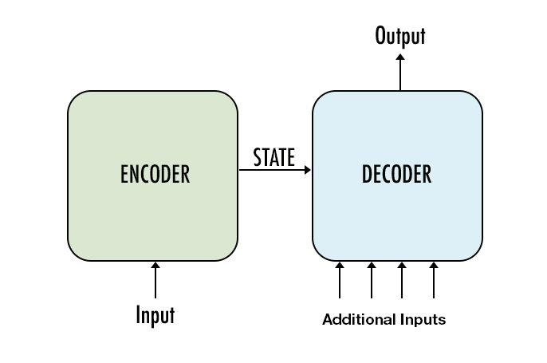
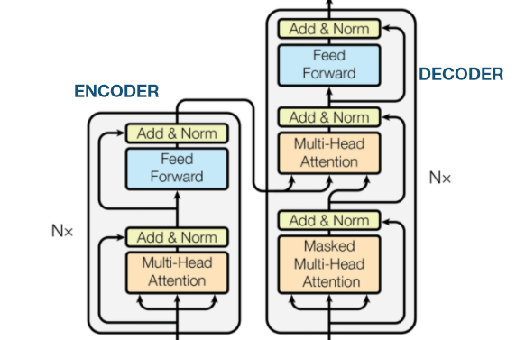
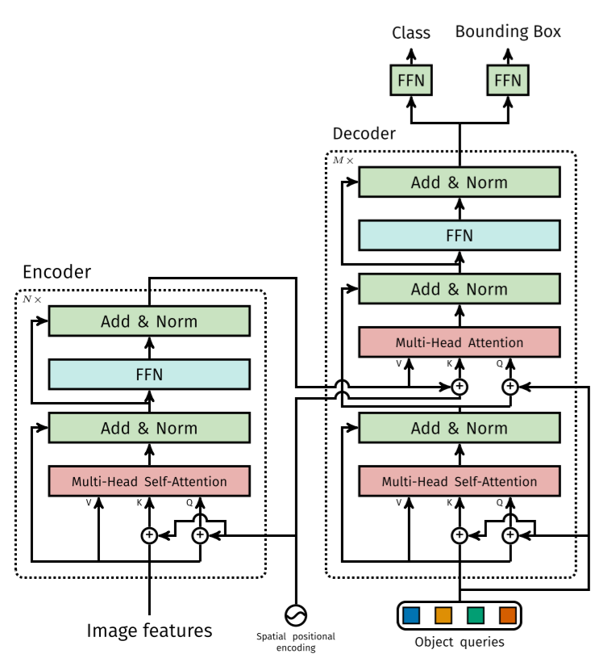
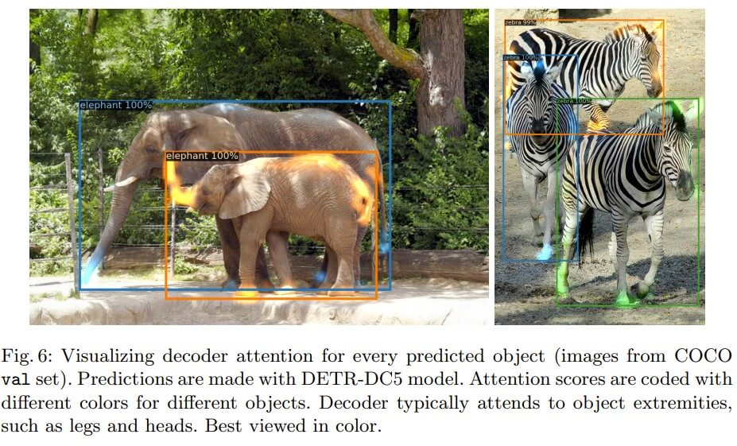
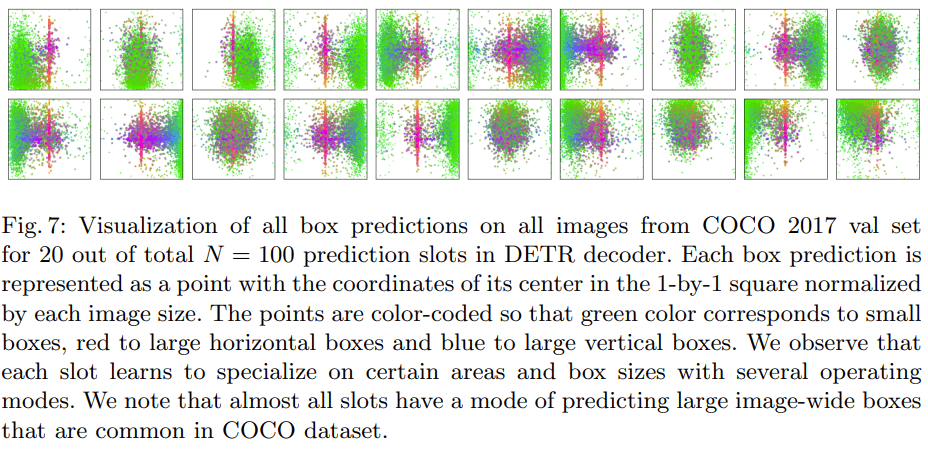
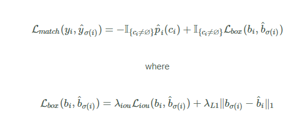
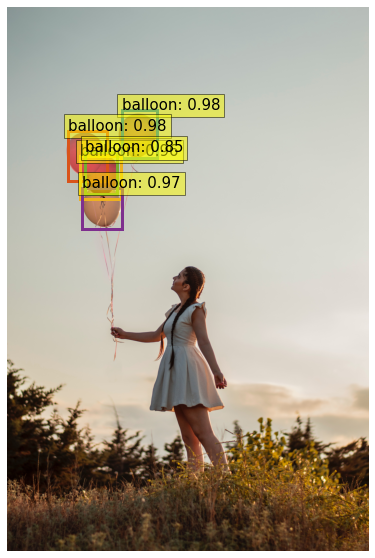
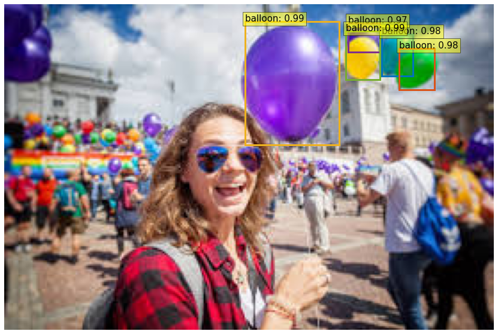
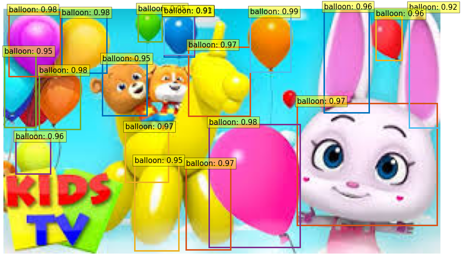

What is DETR
=================
DETR which stands for DEtection TRansformer is developed by Facebook AI and probably the most effective Computer Vision Algorithm which is empowered with Object classification, Object Detection, Semantic Segmentation and many other Deep learning tasks. It extends the Transformer based architecture by infusing more intelligence w.r.t adding many object queries to the Decoder Architecture. Before getting into that Let’s talk about the DETR architecture and understand the improvements it did over the Transformer Architecture.
The Transformer Architecture that we discussed before was having only the Encoder Layer. However, the DETR architecture contains both the Encoder and Decoder Network. The reason is quite obvious as the task we perform using DETR requires a decoder Layer.

Let’s now have a high-level look at the Encoder – Decoder Concept.

In general, the Encoder Network takes some input, performs some operation on the input (encode it), Pass the State to the Decoder network which takes some additional input and predicts the output.
By now we know that the backbone of all the SOA models is Attention Mechanism. Hence it would be very much beneficial to have a good look of the Attention in Encoder and Attention in Decoder first and then extend the understanding for DETR architecture 

The Encoder Network takes the input and perform Self attention on the input data. The input is divided into three parts 

1. Key : It can be considered as the entire Database 
2. Query : This specifies the one for which we are finding out the Attention . 
3. Value : It’s the output of the Query when acted upon key 

# Example 

We are providing a key in the google search bar which finds out the value of our search from the big corpus called key
Here it’s worth noting that the Self-attention uses multiple heads for better performance, hence called Multi Headed Attention. The output then passes through a Feed forward network which is a Neural network. The output of the Feed forward network which is the Encoded Key and Value. This gets fed to the Decoder layer.
The Decoder layer gets the Query and similarly performs Self attention on the Query. It also contains multiple heads. Now the Processed Query from first attention block of Decoder network along with the output Key and Value from Encoder layer gets fed into another attention layer called Encoder-Decoder Attention. This is also a multi headed processing layer. The output of the Encoder-Decoder Attention is processed through another feed forward network which provides the output.
The DETR architecture is also very much similar. Let’s see the image of the architecture 

# Encoder Network

The Input to the Encoder Network is the image features (Basically the patches of the image) which gets converted to Key, Query and Value. 
The Position embedding of the patches goes through sine transformation (Can be other methods as well, sine is just an example here) and gets added to the Key and Query.
The updated Key, Query and value gets into the Multi headed Attention layer
The Output of the Attention layer goes through a feed forward network
The output of the FFN is the Encoded value which becomes an input to the Decoder architecture before prediction 

# Decoder Network

The Decoder Network gets object queries. For example, imagine you are looking at a picture of Times square and asking questions like is there an Apple store in the corner 
Likewise, there can be multiple object queries which gets into the Decoder Multi Headed Self-attention layer. Before it feeds in there the values gets added to itself. This is little weird but that’s exactly how it happens.
The Key, Query and Value gets into the Self attention layer.
The Positional Encoding gets added to the output key of the encoder layer
The object queries, Updated Key and value from Encoder layer then fed into the second Attention block which is called Encoder-Decoder Attention.
This output then goes through a Feed forward layer and provides 2 outputs (Class and Bounding Boxes)
That’s the output of the Decoder layer 

This architecture is very powerful as the DETR network not only predicts the class and bounding boxes but it can successfully disassociate the other class overlaps to a great extent.
Here is a simple example output from DETR network 

Few things to remember is 

•	DETR can be easily generalized to produce panoptic segmentation in a unified manner. We show that it significantly outperforms competitive baselines

•	DETR works with a minimum 480x480 resolution but can go much higher

•	There is no class token in DETR

•	DETR guys performed experiments with fixed sine-based fixed positional encodings and learned encodings. In their results they found, fixed sine positional encoding to perform slightly better than learned positional encodings

•	DETR uses ResNet50 as the backbone

•	Unlike YOLO we don’t need to predict bunding boxes in case of DETR. It automatically performs it. Here is a small visualization of the output of the centroid of bounding boxes it predicts 

•	We will talk about the learning process below  

Encoder-decoder architecture
=================================
The Encoder Network takes the input and perform Self-attention on the input data. The input is divided into three parts 

1. Key : It can be considered as the entire Database 
2. Query : This specifies the one for which we are finding out the Attention . 
3. Value : It’s the output of the Query when acted upon key 

# Example 

We are providing a key in the google search bar which finds out the value of our search from the big corpus called key
Here it’s worth noting that the Self-attention uses multiple heads for better performance, hence called Multi Headed Attention. The output then passes through a Feed forward network which is a Neural network. The output of the Feed forward network which is the Encoded Key and Value. This gets fed to the Decoder layer.
The Decoder layer gets the Query and similarly performs Self attention on the Query. It also contains multiple heads. Now the Processed Query from first attention block of Decoder network along with the output Key and Value from Encoder layer gets fed into another attention layer called Encoder-Decoder Attention. This is also a multi headed processing layer. The output of the Encoder-Decoder Attention is processed through another feed forward network which provides the output.

Bipartite loss
====================
Unlike any other Neural network, we also need a loss function for the DETR network as well. But this loss function is very unique by itself. It’s called Bipartite matching loss. 
Let’s take an example, let’s say we have the image of a kid’s room which contains many items and our job is to identify each object and the location of the object using bounding boxes. TheDETR network outputs the objects and the bounding boxes as well.  

1.	But does the network predict the centroid of the objects accurately?
2.	Does the network predict properly when multiple objects of the same class present (say one small and one big)?
3.	How it predicts when nothing is there in the location
4.	If it can’t predict the location accurately then is the loss going to be very huge and the network can’t learn the centroid s accurately at all?

This is where the Bipartite loss comes handy. It performs the updates as follows

1.	The loss takes into account the type of object and not the location 
2.	The loss takes into account the number of objects 
3.	The loss tries to find out the object which has lowest distance/error 

That means let’s say in the room there are 2 cricket bats, 1 foot ball then as long as the network predicts both cricket bats and ball, the job is almost over. The network then needs to match the cricket bats of Ground truth to the prediction which has the lowest distance  
Now let’s say there are no hockey bats and network predict a hocket bat then it has to go and correct itself as it will get a high loss 
Similarly, when there are no objects in GT and same is predicted by Network then no loss is logged. We can see the mathematics of loss function below and it should be easily understood 

object queries
===============

If you have already read the above texts then I am sure you understand what object queries here means. But in this example, I would like to take an image and explain how object queries are decided. Let’s see the below image

What are different questions that comes to your mind? let’s say
1.	Who is the one with the ball now? 
2.	Can you identify the player with red shirt and first from the left?
3.	Who is the Midfielder with Blue T-shirt?
4.	Which country the first player from left belongs to?
5.	Is it an offsite? 

Now imagine you are performing the Image identification, Object Detection, Image segmentation kind of solution here using DETR Encoder/Decoder Architecture. 
The Object queries which are input to the Decoder Self attention layer are type of queries which the network tries to address using the output from the Encoder layer and Attention layer followed by FFN of the Decoder network.

Model Training output
======================
IoU metric: bbox
 Average Precision  (AP) @[ IoU=0.50:0.95 | area=   all | maxDets=100 ] = 0.468
 Average Precision  (AP) @[ IoU=0.50      | area=   all | maxDets=100 ] = 0.760
 Average Precision  (AP) @[ IoU=0.75      | area=   all | maxDets=100 ] = 0.511
 Average Precision  (AP) @[ IoU=0.50:0.95 | area= small | maxDets=100 ] = 0.426
 Average Precision  (AP) @[ IoU=0.50:0.95 | area=medium | maxDets=100 ] = 0.682
 Average Precision  (AP) @[ IoU=0.50:0.95 | area= large | maxDets=100 ] = -1.000
 Average Recall     (AR) @[ IoU=0.50:0.95 | area=   all | maxDets=  1 ] = 0.182
 Average Recall     (AR) @[ IoU=0.50:0.95 | area=   all | maxDets= 10 ] = 0.524
 Average Recall     (AR) @[ IoU=0.50:0.95 | area=   all | maxDets=100 ] = 0.562
 Average Recall     (AR) @[ IoU=0.50:0.95 | area= small | maxDets=100 ] = 0.433
 Average Recall     (AR) @[ IoU=0.50:0.95 | area=medium | maxDets=100 ] = 0.713
 Average Recall     (AR) @[ IoU=0.50:0.95 | area= large | maxDets=100 ] = -1.000
Training time 0:02:39

